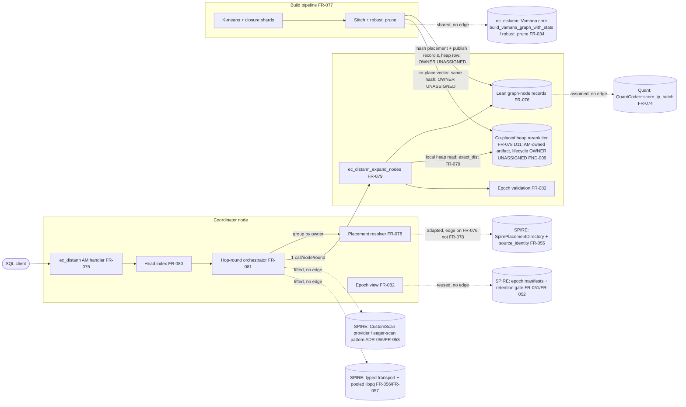

# SR-007: Scope and Boundary Analysis — ec_distann Spec Batch

## Summary

Scope-boundary analysis of the ec_distann batch (StR-008, FR-075..FR-083,
NFR-017..NFR-020, ADR-085), re-run against revision d25ea9e0c which replaced
the inline full-precision vector in the graph record with a **co-placed heap
rerank tier** (FR-076 lean record; FR-078 co-places the heap row on the
`hash(vec_id)`-owned node; FR-079 exact_dist from the local heap read;
ADR-085 D11; NFR-018 heap tier as the 1.0× baseline). Coverage: (1) the
central boundary question this revision raises — does co-placing "the
full-precision heap row" on each data node silently expand scope to
"distributing the base table"; (2) the coordinator vs data-node
responsibility split; (3) recorded out-of-scope items; (4) silent expansion.

**Boundary verdict on the revision: co-placement stays inside ec_distann's
boundary; it does NOT silently expand scope to sharding the user base
table.** FR-078 is explicit that the AM-managed epoch build→publish pipeline
owns getting the vector onto the node ("the build SHALL write each record
**and its full-precision vector (heap row)** to the same hash-owned node …
no other component moves records or vectors. The vector is stored once, on
the owning node, and is never duplicated into the index record"). This
frames the rerank tier as an AM-owned, once-stored, epoch-build artifact
co-located by the identical `hash(vec_id)` — not the Postgres base-table
heap being externally sharded across data nodes. The single-node (M0) case
is the trivial one (index + base table share one instance). The residual
softness is naming/lifecycle, not a scope grab (FND-008, FND-009 below).

**What is well-bounded.** The read-path split remains clean and the
revision preserves it: the coordinator owns head-index descent, hop-round
orchestration, visited-set dedupe, per-node batching, and the result heap;
each data node owns the local index-record read + the co-located LOCAL heap
read + the exact distance (FR-079). Co-placement keeps both reads node-local
(no new rerank round-trip), so the revision does not blur the
coordinator/data-node line — it deepens the data node's read to two local
reads without moving work across the boundary. FR-078's "placement affects
load balance only" and its topology-only directory remain exemplary boundary
statements. BatANN baton passing (D4) and injected-latency gating (D2) stay
recorded out-of-scope; the partitioned-SPIRE lane stays shelved.

**Where boundaries are soft.** Nine findings. Two priors are now resolved by
the revision (the divergent-node sub-question of FND-001; see below). The
most serious open item is unchanged by the revision: the committed
incremental-insert milestone (FR-083) specifies distributed remote *writes*
with no owning component — and the revision widens that gap, since an insert
must now land both the record AND its co-placed heap row remotely (FND-001).
The build→publish hand-off is still owned by no node-level FR, and the
revision loads the co-placed heap tier onto the same unowned seam (FND-002).
Reuse posture toward SPIRE/ec_diskann machinery is still edge-less
(FND-003/FND-004) — and the revision sharpens FND-003 by staking a deeper
"this is the ec_diskann coarse-in-index/exact-from-heap split, sharded"
claim with still no FR-034 edge. New this revision: the "heap row"/`heap_tid`
naming is borrowed from single-node ec_diskann and blurs whether a remote
data node holds an AM artifact or the base-table heap itself (FND-008), and
the co-placed heap tier's epoch lifecycle is placed (FR-078) but not
enumerated in FR-082's build-assembly / atomic-publication / retirement set
(FND-009). Learned routing is still unrecorded as out-of-scope (FND-005).

## System Context

## In-Scope Responsibilities

- One global Vamana graph; lean node records (coarse code + adjacency +
  neighbor codes) keyed by global vec_id, with the full vector in a co-placed
  heap tier for node-local exact rerank (FR-075, FR-076; ADR-085 D1/D6/D11).
- Sharded closure-overlap build and stitch to one record per vec_id
  (FR-077, D8).
- Deterministic hash placement + topology-only placement directory, plus
  co-placement of each record's full-precision heap row on the same
  `hash(vec_id)`-owned node — an AM-managed, once-stored rerank artifact, not
  an externally sharded base table (FR-078; ADR-085 D11).
- Data-node batch expansion endpoint with epoch/placement validation, and
  node-local exact rerank from the co-located heap read (FR-079).
- Coordinator head index, hop-round beam search, BW×H cap, convergence
  early-exit (FR-080, FR-081, D3/D9).
- Epoch lifecycle Building→Published→Retired with fingerprint-checked reads
  (FR-082).
- Tombstone delete, interim insert posture (D5), committed incremental
  distributed insert (FR-083).
- Gates: NFR-017 (recall/latency vs IVF anchor), NFR-018 (≤4× space),
  NFR-019 (touch bound), NFR-020 (error-not-partial fault behavior).

## External Dependencies

| Dependency | Type | Assumed or Guaranteed | Contract |
|------------|------|------------------------|----------|
| SPIRE CustomScan provider / eager-scan pattern (ADR-056, FR-058) | Reused code ("lifted") | Assumed — reuse mode and edge missing (FND-003) | None declared |
| SPIRE typed transport + post-142 pooled libpq (FR-056, FR-057) | Reused code ("lifted") | Assumed — no edge (FND-003) | FR-079-AC via drills, indirectly |
| SPIRE epoch-manifest machinery + retention gate (FR-051, FR-052) | Reused code ("reusing") | Assumed — no edge (FND-003) | FR-082-AC-1..3 exercise behavior |
| SpirePlacementDirectory (FR-055) | Adapted (topology-only divergence) | Guaranteed for identity via FR-076→FR-055 edge; adapter FR-078 lacks the edge (FND-003) | FR-078-AC-1/3 |
| ADR-068 source-identity contract | Contract | Guaranteed | FR-076-AC-2 (vec_id stability) |
| ec_diskann Vamana core (`build_vamana_graph_with_stats`, `robust_prune`) | Shared library | Guaranteed behaviorally (FR-075-AC-4 parity, FR-077-AC-1) but no spec edge (FND-003) | FR-075-AC-4 |
| SPIRE closure/distance-ratio assignment (`src/am/ec_spire/build/routing_plan.rs`) | Repurposed source file | Assumed — named by path, no edge, shared-vs-forked undecided (FND-004) | FR-077 property tests, indirectly |
| SPIRE top-graph in-memory Vamana builder | Reused code | Assumed — no edge (FND-004) | FR-080-AC-2 |
| QuantCodec scoring (FR-074) | Shared trait | Guaranteed behaviorally (FR-079-AC-4) but no edge (FND-003) | FR-076-AC-3, FR-079-AC-4 |
| PostgreSQL index AM API | Platform | Assumed | pgrx / FR-075-AC-1 |
| `ecaz bench suite` protocol (FR-038, Task 146 anchors) | Measurement harness | Guaranteed | NFR-017 verification section |

## Responsibility Allocation

| Requirement | Owning Component | Class |
|-------------|------------------|-------|
| StR-008 | ec_distann lane (program) | core |
| FR-075 (AM surface, reloptions, GUCs) | Coordinator AM handler | core |
| FR-076 (lean record format, vec_id; heap_tid → co-placed heap row) | Data-node storage | infrastructure |
| FR-077 (sharded build + stitch) | Build pipeline (executor node unnamed — FND-002) | core |
| FR-078 (hash placement, directory, heap-row co-placement) | Coordinator + every node (deterministic shared function); directory + co-placed heap tier: infrastructure (tier lifecycle owner unstated — FND-009) | infrastructure |
| FR-079 (expand endpoint; local index read + local heap read + exact_dist) | Data node | core |
| Co-placed heap rerank tier (D11) — placement | FR-078 (build→publish hand-off, same as records — FND-002) | infrastructure |
| Co-placed heap rerank tier (D11) — epoch lifecycle/versioning | UNOWNED: not in FR-082 build-assembly / publication triple / retirement (FND-009) | infrastructure |
| FR-080 (head index) | Coordinator (sample persistence location unassigned — FND-007) | core |
| FR-081 (orchestration, dedupe, cap) | Coordinator | core |
| FR-082 (epoch lifecycle; validation at data node, retry at coordinator) | Coordinator + data node, split explicit | infrastructure |
| FR-083 (delete/interim insert: local AM; incremental insert remote writes: UNOWNED — FND-001) | Coordinator AM + unspecified remote-write path | core |
| NFR-017 (gate) | Bench harness over FR-081 | cross-cutting |
| NFR-018 (space budget) | Data-node storage + build instrumentation | cross-cutting |
| NFR-019 (touch bound) | Coordinator counters + bench assertion | cross-cutting |
| NFR-020 (fault behavior) | Coordinator (fail-not-degrade policy) + data node (typed errors) | cross-cutting |

## Findings

| ID | Severity | Summary | Refs |
|----|----------|---------|------|
| FND-001 | high | The committed incremental-insert milestone has remote *writes* with no owning component or protocol FR — and the d25ea9e0c revision *widens* the gap: an insert must now place both the graph record AND its co-placed full-precision heap row on the vec_id's owning node, yet only a remote *read* endpoint exists (FR-079). Still unassigned: which component executes the back-edge re-prune (coordinator RMW vs a data-node-local write function), the remote-write endpoint/contract, and — new — the remote write of the co-placed heap row. NFR-020 gates "mid-insert failure" against a path no FR allocates. **Partially resolved by the revision:** the prior sub-question "where `aminsert` runs when the heap row's node differs from the record's node" is now moot — FR-078 guarantees the heap row is co-placed on the *same* hash-owned node — but that just relocates the unowned write, it does not assign it. | FR-083 Behavior; FR-078 Behavior (co-placement); FR-079 (read-only); NFR-020 Scope; ADR-085 D6/D11 |
| FND-002 | medium | The build→publish hand-off that physically distributes records to their owning nodes is unowned, and the revision loads a second artifact onto the same seam. FR-078 now says the build SHALL write "each record **and its full-precision vector (heap row)**" to the hash-owned node and "no other component moves records or vectors" — but still names no node/executor: FR-077 ends at "emit exactly one record per vec_id", and FR-082 says "a build SHALL assemble the full record set, placement metadata, and head sample" without naming which node runs the build or writes record+vector X onto data node Y. Every other pipeline step has an owner; this three-FR seam — now carrying the heap tier too — does not. | FR-077 Workflow/Behavior; FR-078 Behavior; FR-082 Behavior |
| FND-003 | medium | Reuse mode per subsystem is unstated and the batch carries no relationship edges to the owning FRs of the reused machinery; the revision *sharpens* the ec_diskann case. ADR-085 says "lifted" (CustomScan/transport/epoch), FR-078 "adapted" (SpirePlacementDirectory), FR-082 "reusing" (epoch manifests), FR-077 "repurposed" — but no FR declares shared-vs-fork. The only cross-family edge is FR-076→FR-055 (identity); FR-078 (the SpirePlacementDirectory adapter) has no FR-055 edge; FR-079/FR-081 no edge to FR-056/FR-057/FR-058; FR-082 none to FR-051/FR-052; FR-075/FR-077 none to FR-034. FR-076/FR-079 now *repeatedly* stake "this is the `ec_diskann` coarse-in-index / exact-from-heap split, sharded" (D11) — a deeper behavioral-parity claim on ec_diskann than before — yet still carry no edge to FR-034 (the ec_diskann Vamana/heap-rerank owner); FR-076 still names FR-074 (QuantCodec) only in prose. | FR-076..FR-082 frontmatter; spire/distributed/FR-055..058; index/diskann/FR-034; quant/FR-074; ADR-085 D5/D11 |
| FND-004 | medium | Two FRs reach directly into SPIRE-owned implementation with no spec relationship, risking silent expansion into SPIRE's territory: FR-077 names `src/am/ec_spire/build/routing_plan.rs` (distance-ratio closure assignment, specced under the SPIRE build family) as machinery to repurpose, and FR-080 reuses "the in-memory Vamana builder used by the SPIRE top-graph". If these are adapted in place, ec_distann changes behavior under SPIRE's spec ownership; if forked, the fork is undocumented. Either way an explicit edge (or an extract-to-shared-module statement) is required — especially since the SPIRE lane is shelved-with-evidence and its specs remain APPROVED. | FR-077 Behavior; FR-080 Behavior; ADR-085 Consequences ("reused, not discarded") |
| FND-005 | low | Learned routing is not recorded as out-of-scope. ADR-085 records BatANN baton passing (D4, with reopen trigger) and injected-latency gating (D2, informational only), but learned routing appears in neither Sub-Decisions nor Rejected Alternatives, so nothing prevents it re-entering scope unrecorded. Add it to ADR-085's rejected/deferred list with a one-line rationale. | ADR-085 Sub-Decisions D2/D4, Rejected Alternatives |
| FND-006 | low | The single-node vs multinode mode boundary has no determinant. FR-075 switches behavior on "while the index participates in a multinode deployment" and FR-081 on "while the deployment is single-node", but no requirement states what makes an index a participant (roster in the placement directory? a registration step? a GUC?) or which component decides at plan/scan time. The mode selects between two different execution paths, so its owner should be explicit. | FR-075 Behavior; FR-081 Behavior; FR-078 (roster) |
| FND-007 | low | FR-080's head-sample persistence location is unassigned: the pipeline SHALL "persist the sample with the epoch", but not where (coordinator-local relation, epoch manifest payload, or a data node), even though FR-082 lists the head sample as part of atomic publication. The revision adds a second such artifact — the co-placed heap tier (FND-009) — so this is no longer the only epoch artifact with an unstated storage owner. | FR-080 Behavior; FR-082 Behavior (publication triple) |
| FND-008 | medium | The co-placed rerank tier's *nature* is under-pinned because the spec reuses single-node `ec_diskann` naming across the node boundary. FR-076 defines `heap_tid` as "owning heap tuple" (an `ItemPointer`, i.e. a base-table TID), and FR-078/FR-079 call the co-placed artifact the "heap row" resolved "via `heap_tid`". In single-node (M0) `heap_tid` legitimately indexes the base-table heap. In multi-node, FR-078 instead has the build→publish pipeline *ship* "its full-precision vector (heap row)" to the owning node and stores it "once, on the owning node" — an AM-managed artifact, not necessarily the Postgres base-table heap. The spec never states, on a remote data node, whether `heap_tid` still denotes a base-table `ItemPointer` (which would imply the base table is present/sharded on each node — the very boundary claim the revision means to avoid) or an opaque handle into an AM-owned rerank tier. The boundary verdict (AM artifact, in-scope) is *implied* by "stored once, no other component moves vectors" but not stated normatively; a one-line invariant ("the co-placed tier is an AM-owned epoch artifact; on a data node `heap_tid` resolves within that tier, not the user base table") would close the ambiguity. | FR-076 Layout (`heap_tid`); FR-078 Behavior (ship/store once); FR-079 (exact_dist via `heap_tid`); ADR-085 D11 |
| FND-009 | low | The co-placed heap tier is *placed* (FR-078) but its *epoch lifecycle* is not enumerated in FR-082. FR-082's build clause assembles "the full record set, placement metadata, and head sample"; its atomic-publication triple is "(manifest, placement, head sample)"; its retirement gate reclaims "a Retired epoch's storage" — none of these name the co-placed vector tier, even though it is epoch-scoped state that must be built, published atomically with the records it reranks, and reclaimed on retirement. FR-078 assigns placement + the build→publish write, but no FR/AC assigns the tier's versioning, atomic publication, or retirement reclaim. Add the heap tier to FR-082's build-assembly set, publication set, and retention gate (or an explicit AC), so it is not an orphan artifact between FR-078 placement and FR-082 lifecycle. | FR-082 Behavior (assembly/publication/retirement); FR-078 Behavior; NFR-018 (heap tier baseline) |
