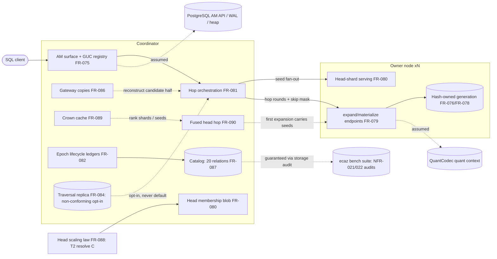

# SR-007: Scope and Boundary Analysis — ec_distann Tasks 211-214 Round

## Summary

Scope-boundary re-run for the Tasks 211-214 spec round at HEAD 8165ff2d8:
the full distann FR set FR-075..FR-090 (FR-085's Bounded Context section as
the boundary anchor), NFR-021/NFR-022, and ADR-087. Prior-round content
(SR-007 at d25ea9e0c/b19551e21, FND-001..FND-009 all resolved) stands in git
history; the finding numbering below restarts for this round.

This round's boundary questions: ownership allocation across the head stack
(FR-080 head / FR-086 gateway copies / FR-089 crown / FR-090 fused hop);
consistency of the legacy-v4-lane boundary; FR-087 catalog vs FR-082
lifecycle ownership; single-artifact ownership of the NFR-021 storage
classes; ADR-087/FR-084/FR-086 decision ownership; and whether the Task
211/212/213 FRs (FR-088/FR-089/FR-090) are implementable without reaching
into review packets for normative content.

**What is well-bounded.** The skip-mask wire field is a model allocation:
FR-079 carries the `skip_neighbor_vec_ids` parameter on its wire contract
and explicitly delegates "mechanism, bound, and fallback" to FR-086;
FR-081 owns the coordinator-side reconstruction and single batch-limit
re-application. The legacy `distributed_control=false` lane boundary is
drawn consistently everywhere it appears — FR-085 Bounded Context (anchor),
FR-075 "Deployment mode and lanes", FR-076 lane-disjoint decoders, FR-078
"Boundary: legacy session-GUC roster lane", FR-079 "Legacy-substrate
endpoint shapes" plus the loopback third lane, FR-082 "Legacy Substrate
(Non-Normative Boundary)", FR-083 Tier-1 — all naming it fixture/bootstrap
substrate outside the domain model and never decision-bearing. ADR-087's
three decisions each land on a named normative owner (FR-080 sharded-head
default; FR-084 conformance-posture demotion; FR-086 TRAV-30), and FR-084
carries the demotion in its own text rather than by ADR pointer.

**What is not.** The main gaps are (a) the "bounded codes-only class" and
the NFR-021 `bounded` storage class are defined in two artifacts with
conflicting bounding-parameter sets (FND-001); (b) the FR-085 Bounded
Context enumeration stops at FR-084, orphaning FR-086..FR-090 from the
boundary anchor (FND-002); (c) the FR-090 fused-request wire field and seed
policy are ownerless in exactly the place where the skip-mask pattern
succeeded (FND-003/FND-004); (d) head-replica reclaim behavior sits between
FR-087 (schema gap notes) and FR-082 (lifecycle owner, silent) with no
behavioral owner (FND-005).

## System Context

## In-Scope Responsibilities

- AM surface, reloption/GUC registry, lane selection (FR-075).
- Record/handoff formats, hash placement, sharded build+stitch, catalog
  persistence (FR-076/FR-077/FR-078/FR-087).
- Read path: expansion/materialization wire (FR-079), sharded
  membership-only head + replicas (FR-080), orchestration (FR-081),
  gateway copies (FR-086), crown (FR-089), fused hop (FR-090).
- Head capacity as a build-resolved sampling law (FR-088).
- Epoch lifecycle, DML, opt-in traversal replica (FR-082/FR-083/FR-084).
- Conformance envelope and control validity (NFR-021/NFR-022, ADR-087).

## External Dependencies

| Dependency | Type | Assumed or Guaranteed | Contract |
|------------|------|------------------------|----------|
| QuantCodec scoring (quant context) | Shared trait | Guaranteed behaviorally | FR-079-AC-4 |
| PostgreSQL AM API, WAL, heap visibility | Platform | Assumed | pgrx / FR-075-AC-1 |
| ADR-063 source-identity (vec_id) | Contract | Guaranteed | FR-076 identity ACs |
| `ecaz bench suite` conformance/storage audits | Measurement harness | Guaranteed (with recorded machinery gaps in NFR-021/022 Verification) | NFR-021 audit rows, NFR-022 labeling |
| Lifted SPIRE transport (pooling, deadlines) | Reused code | Guaranteed via FR-081 deadline clauses (F9 gap recorded) | FR-081-AC-6 |

## Responsibility Allocation

| Requirement | Owning Component | Class |
|-------------|------------------|-------|
| FR-075 (AM surface, GUC registry, lanes) | Coordinator AM handler | core |
| FR-076 (record/handoff formats) | Owner-node storage | infrastructure |
| FR-077 (sharded build + stitch) | Coordinator build pipeline | core |
| FR-078 (placement, registry, build protocol) | Coordinator + shared placement function | infrastructure |
| FR-079 (expansion/materialization wire, skip-mask field carrier) | Owner node endpoints | core |
| FR-080 (head selection, membership persistence, shard serving, replicas, seed_count policy) | Build (T2) + owner shard serving + coordinator merge | core |
| FR-081 (hop rounds, L-bound, gateway reconstruction merge) | Coordinator orchestrator | core |
| FR-082 (epoch lifecycle, retire fence) | Coordinator ledgers + participant lifecycle endpoints | infrastructure |
| FR-083 (DML path) | Owner-local AM + coordinator gate | core |
| FR-084 (traversal replica, non-conforming opt-in) | Coordinator (opt-in accelerator) | core |
| FR-085 (domain model, bounded context anchor) | Spec-level anchor | core |
| FR-086 (gateway copies: bound, content, population, skip-mask semantics, staleness rule) | Coordinator bounded cache | core |
| FR-087 (catalog relations, storage-class tags, privileges) | Extension bootstrap SQL / catalog | infrastructure |
| FR-088 (head scaling law, sizing attestation) | Build (T2 resolution) + manifest | core |
| FR-089 (crown: capacity, selection, lifecycle, fallback) | Coordinator bounded cache | core |
| FR-090 (fused head hop) | Coordinator scan + FR-079 wire (see FND-003) | core |
| NFR-021 (distribution invariant, storage-class vocabulary) | Suite audits + every node | cross-cutting |
| NFR-022 (control validity, pre-registration screen) | Suite + packet process | cross-cutting |
| ADR-087 (defaults and demotion decisions) | Decisions delegated to FR-080/FR-084/FR-086 | core |

## Findings

| ID | Severity | Summary | Refs |
|----|----------|---------|------|
| FND-001 | high | The `bounded` storage class has two conflicting defining artifacts. NFR-021's normative "Storage-class vocabulary" bounds `bounded` by "k, L, dimension, roster size, or relation/projection count" — head capacity C and the capacity GUCs are absent from that list, and NFR-021 states "The head index is not on that list". Yet FR-087 re-defines `bounded` in its own words ("capacity C divided across the roster, times the replica count... may hold landmark vectors"), tags four head relations `bounded`, and FR-086/FR-089 require structures bounded by `gateway_copy_capacity`/`crown_capacity` to pre-register as the "bounded codes-only class" (a phrase with no single normative definition — it exists as FR-086 behavior, FR-089 citation, and ADR-087 consequence). A literal NFR-021 audit cannot classify the gateway set, crown, or head-shard replica rows as `bounded` without violating the vocabulary; a producer following FR-087 conflicts with the artifact its audit runs under. One artifact should own the class vocabulary (NFR-021, extended with capacity-C/GUC bounding parameters and a named "bounded codes-only" subclass), with FR-086/FR-087/FR-089 citing rather than restating it. | NFR-021 (Storage-class vocabulary); FR-087 (Description class defs, CON-1); FR-086 (Description, CON-1); FR-089 (Conformance, CON-1); ADR-087 (Consequences) |
| FND-002 | medium | The FR-085 Bounded Context — named boundary anchor for this round — enumerates only FR-075..FR-084 and its Dependencies list "Downstream: FR-075..FR-084", orphaning FR-086 (gateway copies), FR-087 (catalog), FR-088 (head law), FR-089 (crown), and FR-090 (fused hop) from the boundary even though FR-085's own Domain Terms define "Gateway copy", "Head shard", and "Head replica" and Domain Rule 7 governs bounded coordinator structures. Nothing states whether the crown/fused-hop/catalog requirements are inside the DistANN bounded context, and the anchor cannot scope requirements it does not name. | FR-085 (Bounded Context, Dependencies); FR-086..FR-090 |
| FND-003 | medium | The fused-request wire extension is ownerless. FR-090 requires the first FR-079 expansion request to carry "crown-code-ranked seed candidates... alongside the first frontier expansion" with owners returning exact seed distances in that response — but FR-079's endpoint contract (the normative 8-parameter wire) has no seed-candidate field, and FR-079 nowhere mentions the fused hop. This is exactly asymmetric with the skip-mask precedent, where FR-079 carries the field and delegates semantics to FR-086. Either FR-079 gains the fused-seed field with an ownership pointer to FR-090, or FR-090 must state that seed candidates ride as ordinary `vec_ids` entries (in which case the positional contract and per-owner split need saying so). As written, an implementer cannot determine which spec owns the wire change. | FR-090 (Behavior: Fused request, AC-1); FR-079 (Endpoint, Dependencies) |
| FND-004 | medium | Seed policy under the crown/fused paths is unallocated. FR-080 owns `seed_count = max(2 × BW, 32)` as fixed internal policy for the unfused head fan-out. FR-090 introduces an "exact seed policy" (fused path reproduces the unfused seed set exactly) vs a labeled "seed-set change", but no artifact defines the exact policy's mechanism, the fused path's seed-candidate count, or whether FR-080's seed_count bound applies to crown-selected candidates — and exact reproduction appears unachievable whenever crown capacity < C (the crown holds a coarser subset, FR-089), which would make the "exact policy" arm empty without saying so. FR-089's width pruning ("fan the head search only to promising shard holders") likewise names no owner for the promising-shard selection rule or its interaction with FR-080's replica-routing clamp. | FR-090 (Seed exactness, AC-4); FR-080 (Serving: seed_count); FR-089 (Width pruning) |
| FND-005 | medium | Head-replica reclaim behavior has no lifecycle owner. FR-087 records as "gaps" that `ec_distann_head_shard_replica` and `ec_distann_head_replica_state` rows SHALL be deleted at epoch retirement and index drop (FR-087-AC-6, CON-7), but FR-082 — the normative owner of retire/reclaim behavior, whose retire flow enumerates what `apply_epoch_retire` deletes — never mentions the epoch-fingerprint-scoped head-replica relations, and FR-080 (which owns replica population and attestation) is silent on teardown. A schema spec's gap note is not a behavioral allocation: the retire endpoint that must perform the deletion is specified in FR-082 without this obligation. Assign the reclaim step to FR-082's retire/cleanup clauses (or explicitly to FR-080's replica lifecycle) and have FR-087 cite it. | FR-087 (head_shard_replica / head_replica_state gaps, AC-6, CON-7); FR-082 (apply_epoch_retire, cleanup clauses); FR-080 (Head-shard replicas) |
| FND-006 | medium | ADR-087's forward-looking gate — "Every future coordinator-resident structure MUST pre-register under the NFR-021 storage-class scheme... and ship activation counters asserted non-zero in its A/B" — has no requirement owner. NFR-022 owns pre-registration screening, but the activation-counter obligation exists only per-FR (FR-086/FR-089/FR-090 observability clauses) and in the ADR's Consequences; an ADR consequence binds no future FR. A structure after FR-090 would inherit no counter obligation from any NFR. Lift the activation-counter rule into NFR-022 (or NFR-021) as a general clause. | ADR-087 (Consequences); NFR-022 (Measurement); FR-086/FR-089/FR-090 (Observability) |
| FND-007 | low | Two distinct "legacy" senses coexist without a terminology fence: (a) the legacy v4 `distributed_control=false` lane (fixture/bootstrap substrate, outside the domain model — FR-075/076/078/079/082/083/085, consistently drawn), and (b) the "legacy coordinator-resident head" (FR-080), which is inside the physical lane as the single-owner degenerate shape / `--local-head` fixture control arm (NFR-022). Both are called "legacy" but sit on opposite sides of the domain boundary; a reader can conflate the always-excluded v4 substrate with the conditionally-conforming single-owner head shape. Suggest distinct terms (e.g. "legacy lane" reserved for v4; "pre-sharding head shape" for the FR-080 case). | FR-080 (Legacy coordinator-resident head); FR-082 (Legacy Substrate); FR-085 (Bounded Context); NFR-022 (Flag-doc contradiction) |
| FND-008 | low | FR-088 imports two constraints whose defining artifact it does not name: the "frozen v1 head-cap validity domain (16..=1,048,576)" (FR-088-CON-1) and the trained-head exact-cap requirement "`training_landmarks_exact` requires C = 4096" — neither appears in FR-080 (which owns head selection and the C reloption); the trained-cap rejection lives in FR-078's build-options validity prose. Otherwise the Task 211/212/213 FRs are self-contained: review-packet citations (task-210/004, task-210/006, task-179/038) are measured-outcome context, not normative content, and FR-090's "Task 205 contract" is restated inline with its FR-079/FR-081 owners. Add explicit cites for the two imported constraints. | FR-088 (Behavior, CON-1); FR-080 (Trained selection, CON-2); FR-078 (build_options validity) |
| FND-009 | low | The traversal replica's O(N) payload relations (`replica_relid`/`directory_relid`) have no assigned NFR-021 storage class in any artifact: FR-087 deliberately excludes them from its twenty relations (saying NFR-021 "accounts [them] as non-conforming replica bytes" — a claim NFR-021 itself never makes in its vocabulary), FR-084 assigns no class, and NFR-021's rule is that an unclassified coordinator-resident relation makes the verdict `unavailable`. When the opt-in is enabled for a context lane, the class tag those relations must carry (`coordinator_resident_unsharded`, presumably, with the context-lane pre-registration absorbing it) is ownerless. Assign it explicitly in FR-084 or NFR-021. | FR-087 (traversal_replica prose); FR-084; NFR-021 (Storage-class vocabulary, unclassified-relation rule) |

## Resolutions (same session, post-review)

- FND-001 resolved: NFR-021's storage-class vocabulary is now the single
  normative definition — extended with head capacity C (and replica
  multiple) and the capacity GUCs as admitted bounding parameters, and a
  named bounded codes-only subclass; FR-086/FR-087/FR-089 cite it instead
  of restating.
- FND-002 resolved: FR-085 Bounded Context, Downstream, Domain Terms
  (crown, fused head hop), and AC-1 now cover FR-086..FR-090.
- FND-003 resolved: FR-090 states the fused request is an ordinary FR-079
  expansion (seed candidates ride as requested vec_ids; FR-079 owns the
  wire; no extension exists or is permitted).
- FND-004 resolved: seed policy allocated — FR-080 owns seed_count
  (max(2 × BW, 32)); FR-090 bounds the fused first round by it and defines
  the exact-policy claimability condition; FR-089 width pruning gains its
  precondition and arm labeling.
- FND-005 resolved: head-replica reclaim assigned to FR-082's retire
  application clause (gap note for the missing code path); FR-087 cites
  FR-082 as the behavioral owner.
- FND-006 resolved: the activation-counter + pre-registration obligation
  generalized into NFR-022 ("Activation evidence" clause).
- FND-007 resolved: FR-080's shape renamed "pre-sharding head shape" with
  a terminology fence reserving "legacy lane" for the v4 substrate.
- FND-008 resolved: FR-088 cites FR-078 for the frozen validity domain and
  the trained-cap rule (CON-1 and the validation clause).
- FND-009 resolved: FR-084 assigns `coordinator_resident_unsharded` to the
  replica payload relations (context-lane-only admissibility); FR-087's
  prose updated to cite that assignment.
