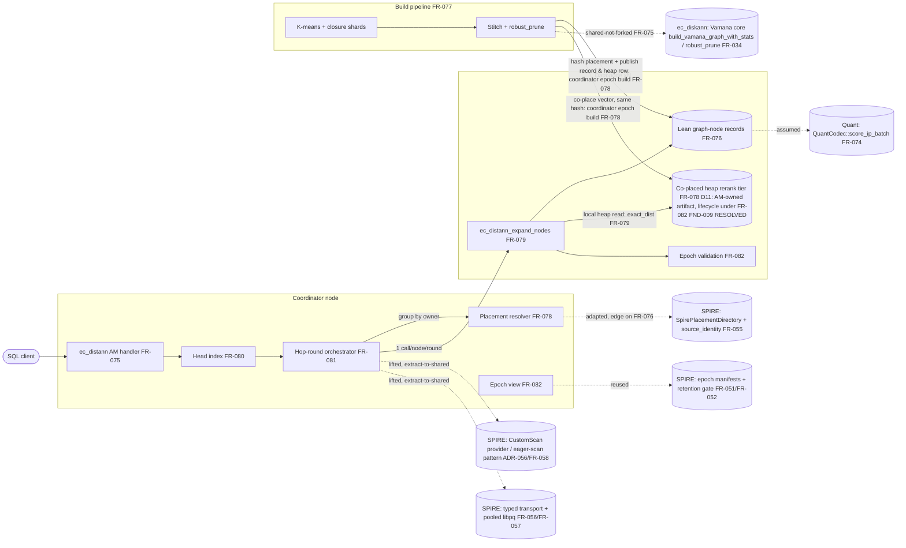

# SR-007: Scope and Boundary Analysis — ec_distann Spec Batch

## Summary

Scope-boundary analysis of the ec_distann batch (StR-008, FR-075..FR-083,
NFR-017..NFR-020, ADR-085), re-run against revision d25ea9e0c which replaced
the inline full-precision vector in the graph record with a **co-placed heap
rerank tier** (FR-076 lean record; FR-078 co-places the heap row on the
`hash(vec_id)`-owned node; FR-079 exact_dist from the local heap read;
ADR-085 D11; NFR-018 heap tier as the 1.0× baseline). Coverage: (1) the
central boundary question this revision raises — does co-placing "the
full-precision heap row" on each data node silently expand scope to
"distributing the base table"; (2) the coordinator vs data-node
responsibility split; (3) recorded out-of-scope items; (4) silent expansion.

**Boundary verdict on the revision: co-placement stays inside ec_distann's
boundary; it does NOT silently expand scope to sharding the user base
table.** FR-078 is explicit that the AM-managed epoch build→publish pipeline
owns getting the vector onto the node ("the build SHALL write each record
**and its full-precision vector (heap row)** to the same hash-owned node …
no other component moves records or vectors. The vector is stored once, on
the owning node, and is never duplicated into the index record"). This
frames the rerank tier as an AM-owned, once-stored, epoch-build artifact
co-located by the identical `hash(vec_id)` — not the Postgres base-table
heap being externally sharded across data nodes. The single-node (M0) case
is the trivial one (index + base table share one instance). The prior
naming/lifecycle softness is now closed normatively: FR-079 fixes `heap_tid`
as an epoch-scoped handle into the AM tier (FND-008), and FR-082 brings the
tier under the full epoch lifecycle (FND-009).

**What is well-bounded.** The read-path split remains clean and the
revision preserves it: the coordinator owns head-index descent, hop-round
orchestration, visited-set dedupe, per-node batching, and the result heap;
each data node owns the local index-record read + the co-located LOCAL heap
read + the exact distance (FR-079). Co-placement keeps both reads node-local
(no new rerank round-trip), so the revision does not blur the
coordinator/data-node line — it deepens the data node's read to two local
reads without moving work across the boundary. FR-078's "placement affects
load balance only" and its topology-only directory remain exemplary boundary
statements. BatANN baton passing (D4) and injected-latency gating (D2) stay
recorded out-of-scope; the partitioned-SPIRE lane stays shelved.

**Disposition after the b19551e21 spec fixes: all nine findings are now
resolved or addressed.** The boundary verdict is unchanged — the reconciled
spec confirms co-placement stays an AM-owned, epoch-scoped artifact inside
ec_distann's boundary and does not shard the user base table. The two most
serious items are RESOLVED: FR-083 now specifies the "Remote write endpoint"
(`ec_distann_apply_record_writes`) with the coordinator driving
`aminsert`/`ambulkdelete`, back-edge re-pruning on the owning data node, and
the co-placed heap row written atomically to the hash-owned node — closing the
unowned incremental-write seam (FND-001) — and FR-078 now names the
coordinator's epoch build pipeline as the owner of the build→publish hand-off,
writing each record and its co-placed vector over the NFR-014 transport
(FND-002). Reuse posture is settled in prose: FR-077/FR-080 declare
extract-to-shared for `routing_plan` and the top-graph Vamana builder, and
FR-075 declares the FR-034 Vamana core shared-not-forked (FND-003/FND-004).
FR-079 now states normatively that `heap_tid` is an epoch-scoped handle into
the AM-owned vector tier, not a live base-table `ItemPointer` on a data node
(FND-008), and FR-082 brings the co-placed vector tier under the full epoch
lifecycle — build assembly, atomic publication, D10 immutability, fingerprint
attestation, and retirement reclaim (FND-009). Mode selection is now
determined by the published manifest's node roster (FND-006), the head sample
is persisted as an epoch-versioned index-relation object listed in the
manifest (FND-007), and ADR-085 records learned routing as a Rejected
Alternative (FND-005). No scope-boundary finding remains open. See the
Findings table for the per-finding disposition tag and its supporting edit.

## System Context

## In-Scope Responsibilities

- One global Vamana graph; lean node records (coarse code + adjacency +
  neighbor codes) keyed by global vec_id, with the full vector in a co-placed
  heap tier for node-local exact rerank (FR-075, FR-076; ADR-085 D1/D6/D11).
- Sharded closure-overlap build and stitch to one record per vec_id
  (FR-077, D8).
- Deterministic hash placement + topology-only placement directory, plus
  co-placement of each record's full-precision heap row on the same
  `hash(vec_id)`-owned node — an AM-managed, once-stored rerank artifact, not
  an externally sharded base table (FR-078; ADR-085 D11).
- Data-node batch expansion endpoint with epoch/placement validation, and
  node-local exact rerank from the co-located heap read (FR-079).
- Coordinator head index, hop-round beam search, BW×H cap, convergence
  early-exit (FR-080, FR-081, D3/D9).
- Epoch lifecycle Building→Published→Retired with fingerprint-checked reads
  (FR-082).
- Tombstone delete, interim insert posture (D5), committed incremental
  distributed insert (FR-083).
- Gates: NFR-017 (recall/latency vs IVF anchor), NFR-018 (≤4× space),
  NFR-019 (touch bound), NFR-020 (error-not-partial fault behavior).

## External Dependencies

| Dependency | Type | Assumed or Guaranteed | Contract |
|------------|------|------------------------|----------|
| SPIRE CustomScan provider / eager-scan pattern (ADR-056, FR-058) | Reused code ("lifted") | Reuse mode declared in prose (FND-003 ADDRESSED); frontmatter edge optional | None declared |
| SPIRE typed transport + post-142 pooled libpq (FR-056, FR-057) | Reused code ("lifted") | Reuse mode declared; FR-078 build→publish cites NFR-014 transport (FND-002/FND-003) | FR-079-AC via drills, indirectly |
| SPIRE epoch-manifest machinery + retention gate (FR-051, FR-052) | Reused code ("reusing") | Reuse mode declared in prose (FND-003 ADDRESSED) | FR-082-AC-1..3 exercise behavior |
| SpirePlacementDirectory (FR-055) | Adapted (topology-only divergence) | Guaranteed for identity via FR-076→FR-055 edge; reuse mode prose-declared (FND-003 ADDRESSED) | FR-078-AC-1/3 |
| ADR-068 source-identity contract | Contract | Guaranteed | FR-076-AC-2 (vec_id stability) |
| ec_diskann Vamana core (`build_vamana_graph_with_stats`, `robust_prune`) | Shared library (FR-075 declares shared-not-forked) | Guaranteed behaviorally (FR-075-AC-4 parity, FR-077-AC-1); reuse mode declared (FND-003 ADDRESSED) | FR-075-AC-4 |
| SPIRE closure/distance-ratio assignment (`src/am/ec_spire/build/routing_plan.rs`) | Extract-to-shared module (FR-077) | Declared extract-to-shared, not fork; SPIRE spec ownership unchanged (FND-004 RESOLVED) | FR-077 property tests, indirectly |
| SPIRE top-graph in-memory Vamana builder | Extract-to-shared module (FR-080) | Declared extract-to-shared, not fork (FND-004 RESOLVED) | FR-080-AC-2 |
| QuantCodec scoring (FR-074) | Shared trait | Guaranteed behaviorally (FR-079-AC-4); reuse mode prose-declared (FND-003 ADDRESSED) | FR-076-AC-3, FR-079-AC-4 |
| PostgreSQL index AM API | Platform | Assumed | pgrx / FR-075-AC-1 |
| `ecaz bench suite` protocol (FR-038, Task 146 anchors) | Measurement harness | Guaranteed | NFR-017 verification section |

## Responsibility Allocation

| Requirement | Owning Component | Class |
|-------------|------------------|-------|
| StR-008 | ec_distann lane (program) | core |
| FR-075 (AM surface, reloptions, GUCs) | Coordinator AM handler | core |
| FR-076 (lean record format, vec_id; heap_tid → co-placed heap row) | Data-node storage | infrastructure |
| FR-077 (sharded build + stitch) | Coordinator epoch build pipeline (build→publish owner named at b19551e21 — FND-002 RESOLVED) | core |
| FR-078 (hash placement, directory, heap-row co-placement) | Coordinator + every node (deterministic shared function); directory + co-placed heap tier: infrastructure (tier lifecycle now under FR-082 — FND-009 RESOLVED) | infrastructure |
| FR-079 (expand endpoint; local index read + local heap read + exact_dist) | Data node | core |
| Co-placed heap rerank tier (D11) — placement | Coordinator epoch build pipeline (build→publish hand-off, same as records, over NFR-014 transport — FND-002 RESOLVED) | infrastructure |
| Co-placed heap rerank tier (D11) — epoch lifecycle/versioning | FR-082 build-assembly / atomic publication / D10 immutability / retirement reclaim (FND-009 RESOLVED) | infrastructure |
| FR-080 (head index) | Coordinator (sample persisted as epoch-versioned index-relation object in the manifest — FND-007 ADDRESSED) | core |
| FR-081 (orchestration, dedupe, cap) | Coordinator | core |
| FR-082 (epoch lifecycle; validation at data node, retry at coordinator) | Coordinator + data node, split explicit | infrastructure |
| FR-083 (delete/interim insert: local AM; incremental insert remote writes via `ec_distann_apply_record_writes`, re-prune on owning data node — FND-001 RESOLVED) | Coordinator AM drives the remote write endpoint; owning data node executes re-prune | core |
| NFR-017 (gate) | Bench harness over FR-081 | cross-cutting |
| NFR-018 (space budget) | Data-node storage + build instrumentation | cross-cutting |
| NFR-019 (touch bound) | Coordinator counters + bench assertion | cross-cutting |
| NFR-020 (fault behavior) | Coordinator (fail-not-degrade policy) + data node (typed errors) | cross-cutting |

## Findings

| ID | Severity | Summary | Refs |
|----|----------|---------|------|
| FND-001 | high | RESOLVED (b19551e21) — FR-083 now specifies a "Remote write endpoint" (`ec_distann_apply_record_writes`, the write counterpart to FR-079: new-record append with its co-placed full-precision heap row, tombstone set, back-edge amendment with per-record `robust_prune`, epoch-fingerprint-validated, per-record atomicity). It assigns all three previously-unowned pieces: `aminsert`/`ambulkdelete` run on the coordinator and drive the endpoint; degree re-pruning (the back-edge re-prune) executes on the data node that owns the amended record; and the new record's co-placed heap row is written atomically to the same hash-owned node (FR-078). NFR-020's "mid-insert failure" now gates a path FR-083 allocates, and the incremental-insert milestone (FR-083-AC-5/AC-7) covers both the dangling-edge and missing-heap-row fault cases. | FR-083 Behavior (Remote write endpoint); FR-078 Behavior (co-placement); FR-079; NFR-020 Scope; ADR-085 D6/D11 |
| FND-002 | medium | RESOLVED (b19551e21) — FR-078 now names the coordinator's epoch build pipeline as the owner that writes each record and its co-placed vector to the hash-owned node over the NFR-014 transport. The build→publish hand-off that physically distributes records (and, since d25ea9e0c, their co-placed full-precision heap rows) is no longer an unowned seam: the executor and transport are stated, closing the prior gap where FR-077 ended at "emit exactly one record per vec_id" and FR-082 assembled the record set without naming which node runs the build or moves record+vector X onto data node Y. | FR-077 Workflow/Behavior; FR-078 Behavior; FR-082 Behavior |
| FND-003 | medium | ADDRESSED — reuse mode is now explicit in prose: FR-077 and FR-080 declare "extract-to-shared (not fork, SPIRE spec ownership unchanged)", and FR-075 already declares the FR-034 Vamana core "shared ... not forked". The frontmatter-edge maximalism (a declared relationship edge per reused FR) is accepted as prose-declared reuse mode — the shared-vs-fork question the finding raised is answered even without exhaustive frontmatter edges. The residual is stylistic (prose vs frontmatter edges), not a scope ambiguity: no reused subsystem is left with an undeclared shared-vs-fork posture. | FR-076..FR-082 frontmatter; spire/distributed/FR-055..058; index/diskann/FR-034; quant/FR-074; ADR-085 D5/D11 |
| FND-004 | medium | RESOLVED — both FR-077 and FR-080 now state extract-to-shared: the pure helper (FR-077's `routing_plan` distance-ratio closure assignment; FR-080's top-graph in-memory Vamana builder) is lifted into a shared module, not edited in place under SPIRE's spec ownership. This is exactly the extract-to-shared-module statement the finding asked for, so neither FR silently expands into SPIRE's territory: the shared code is co-owned via a shared module rather than adapted-in-place or silently forked. | FR-077 Behavior; FR-080 Behavior; ADR-085 Consequences ("reused, not discarded") |
| FND-005 | low | ADDRESSED — ADR-085 Rejected Alternatives now lists "Learned routing over partitions (ADR-052/053 lineage): out of scope for this program", so learned routing is recorded as out-of-scope and cannot re-enter scope unrecorded. This is exactly the rejected/deferred-list entry (with lineage rationale) the finding requested. | ADR-085 Sub-Decisions D2/D4, Rejected Alternatives |
| FND-006 | low | ADDRESSED — FR-075 states the mode is determined by the published epoch manifest's node roster: a roster size greater than 1 means multinode, and no GUC overrides it. This supplies the missing determinant the finding asked for (a concrete, manifest-owned discriminator rather than an unstated registration step or GUC), so the single-node vs multinode path selection now has an explicit owner. | FR-075 Behavior; FR-081 Behavior; FR-078 (roster) |
| FND-007 | low | ADDRESSED — FR-080 states the head sample is persisted "as an epoch-versioned object in the index relation, listed in the epoch manifest", so the storage location the finding flagged as unassigned is now concrete (an index-relation, epoch-versioned object referenced from the manifest) rather than an open choice among coordinator-local relation / manifest payload / data node. | FR-080 Behavior; FR-082 Behavior (publication triple) |
| FND-008 | medium | RESOLVED — FR-079 now carries the exact normative invariant the finding asked for: `heap_tid` SHALL be interpreted as the epoch-scoped handle to the vec_id's frozen co-placed vector, **not** as a live base-table `ItemPointer` on a data node — a data node is not required to host the user base table, only the epoch's vector tier for its owned vec_ids (the single-node degenerate case is called out as the sole place the handle is the local base-table TID). This states normatively that the co-placed tier is an AM-owned epoch artifact and that the base table is not sharded onto data nodes, closing the boundary ambiguity; FR-079 case (d) adds a distinct structural fault when a record's co-placed vector is missing/unreadable. | FR-076 Layout (`heap_tid`); FR-078 Behavior (ship/store once); FR-079 (heap_tid handle / case (d)); ADR-085 D11 |
| FND-009 | low | RESOLVED — FR-082 now enumerates the co-placed vector tier across its full epoch lifecycle: it is included in build assembly, in the atomic publication set, held immutable under D10, attested by fingerprint, and reclaimed on retirement. The tier is no longer an orphan artifact between FR-078 placement and FR-082 lifecycle — its versioning, atomic publication with the records it reranks, and retirement reclaim are all assigned. | FR-082 Behavior (assembly/publication/retirement); FR-078 Behavior; NFR-018 (heap tier baseline) |
