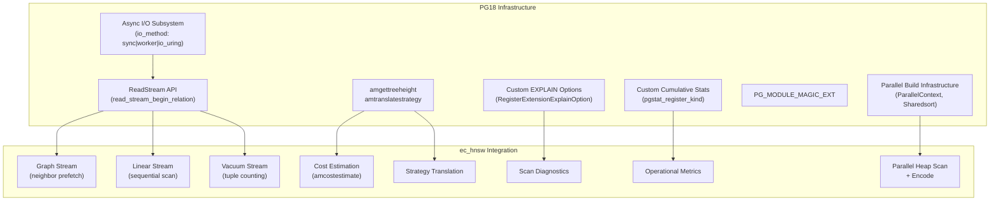

# Master Requirements Specification
## Ecaz — PostgreSQL Extension for TurboQuant Vector Search

---

## 1. Purpose

This document defines the **scope, intent, and governing requirements framework** for Ecaz, a PostgreSQL extension written in Rust (pgrx) that registers a native `tqvector` data type and HNSW index access method over TurboQuant-compressed vectors.

It establishes:
- The problem space: native approximate nearest neighbor (ANN) search in PostgreSQL using TurboQuant quantization for 8x storage compression with provably unbiased inner product estimation
- The boundaries of responsibility: type system, quantizer core, distance computation, index access method, SQL bootstrap — nothing above the Postgres extension boundary
- The authoritative structure for requirements, verification, and change control
- The relationship between the TurboQuant algorithm (arXiv:2504.19874), the HNSW graph structure (`hnsw_rs` crate for bulk build + own page-level graph for runtime), and the Postgres extension interface (pgrx)

This document is the **top-level requirements artifact** for Ecaz.

---

## 2. Scope

### 2.1 In Scope

This specification governs:
- The `tqvector` PostgreSQL data type: wire format, text I/O, binary I/O, storage
- **Quantizer core**: two-stage vector compression (MSE + QJL) implementing the TurboQuant algorithm — SRHT rotation, Lloyd-Max codebook generation, scalar quantization, Gaussian projection residual correction
- **SIMD acceleration**: AVX2+FMA on x86_64 and NEON on aarch64 for FWHT, scoring, and bit operations, with scalar fallback
- Encoding: compression of fp32 vectors into TurboQuant bytecodes via the quantizer core
- Distance functions: LUT-based raw-query-to-code scoring and lower-fidelity code-to-code scoring
- SQL operators: `<#>` overloads for code-to-code comparison and raw-query search
- Operator classes for HNSW index integration
- HNSW index access method (AM): all IndexAmRoutine callbacks — build, insert, scan, vacuum
- Page layout: metadata page, element tuples, neighbor tuples (modeled on pgvector)
- WAL safety: GenericXLog usage for crash-safe page writes
- SQL bootstrap: CREATE TYPE, CREATE OPERATOR, CREATE OPERATOR CLASS, CREATE ACCESS METHOD
- Extension lifecycle: CREATE EXTENSION / DROP EXTENSION / ALTER EXTENSION UPDATE

### 2.2 Out of Scope

This specification does not govern:
- The TurboQuant research algorithm itself (owned by the paper: Zandieh et al., ICLR 2026)
- The HNSW graph construction algorithm itself (owned by `hnsw_rs` crate, used for bulk build only)
- Application-level schema design (e.g., `agent_memories` table — owned by the agent memory system)
- Query routing or application-level orchestration (owned by upstream system components)
- Cosine similarity or L2 distance metrics (inner product only in v0.1)

---

## 3. System Overview

### 3.1 System Description

Ecaz is a PostgreSQL extension that brings TurboQuant-compressed vector storage and HNSW approximate nearest neighbor search directly into the database engine. It is the central component of the agent vector memory system architecture.

**Why build this instead of using existing extensions:**
- **pgvecto.rs**: deprecated, superseded by VectorChord
- **VectorChord**: AGPLv3 / ELv2 licensing — problematic for product use
- **pgvector HNSW**: MIT licensed (reference for page layout), but stores fp32 vectors — no compression, 8x larger storage

Ecaz combines:
1. An **own quantizer core** implementing the TurboQuant two-stage algorithm (MSE + QJL) with AVX2+FMA and NEON SIMD acceleration
2. The `hnsw_rs` crate for graph construction during bulk index build
3. pgvector's page layout as the direct reference for Postgres storage integration
4. pgrx for safe Rust ↔ Postgres FFI

**Compression characteristics** (1536-dim, 4-bit):
- Raw fp32: 6,144 bytes per vector
- tqvector quantized payload: 772 bytes per vector (4-byte gamma + 768 bytes code bytes)
- tqvector total datum size: 783 bytes per vector including the 11-byte datum prefix (`dim`, `bits`, `seed`)
- ~9 element tuples per 8KB Postgres page vs ~1 for pgvector
- Significantly reduced I/O during graph traversal

### 3.2 Query Strategy: HNSW vs Sequential Scan

Not all queries require HNSW. TurboQuant sequential scan over compressed codes is fast enough for small agents:

| Agent Size | Strategy | Latency | Recall |
|---|---|---|---|
| Small partitions / planner chooses seqscan | Sequential scan over tqvector codes | Throughput-bound, benchmarked separately | Approximate |
| >= 500K memories | HNSW index scan | < 5ms p99 | ~94–99% (depends on m) |

Sequential scan can have **higher recall than HNSW** because it scores every row and avoids graph traversal approximation, but it is still bounded by estimator error. The extension must support both paths: code-to-code comparison uses `tqvector_inner_product`, while high-quality search uses a raw-query prepared scorer over `(tqvector, float4[])`. Query-router thresholds are owned by upstream components and SHALL be calibrated from measured throughput, not hard-coded in this specification.

### 3.3 HNSW m Parameter Decision Rules

| m | Index Size/Agent | Recall@10 | Use Case |
|---|---|---|---|
| 16 | ~88MB | ~99% | Only if recall is critical |
| 8 | ~34MB | ~97% | **Default choice** |
| 4 | ~17MB | ~94% | Stub indexes only (always-warm, 20% sample) |

### 3.4 Scoring Architecture

The extension implements two scoring paths:

**LUT-based scoring (raw query to code)**: For HNSW scan and optional sequential scan acceleration where one side is a raw query embedding. The query vector is rotated/projected once, then compiled into a lookup table (LUT); each candidate is scored via table lookups plus a candidate-side QJL residual correction — O(d) with zero allocation per call. This is the primary hot path for index scans.

**Code-to-code scoring (code-to-code)**: For SQL ad-hoc comparison and HNSW runtime insert/search maintenance where both sides are stored compressed codes. Uses `score_ip_encoded_lite` — no decode step, operates directly on packed MSE indices. Lower fidelity than the prepared-query path because the QJL correction is omitted in v0.1, but it avoids query preparation and extra state.

Both paths are SIMD-accelerated (AVX2+FMA on x86_64, NEON on aarch64) with scalar fallback.

### 3.5 PG18 Integration Architecture

PostgreSQL 18 introduces several infrastructure improvements that tqvector integrates with:



**Key integration points:**
- **Async I/O** (FR-019): Two `ReadStream` instances — random-access for graph traversal, sequential for linear scan — provide 3-4x cold-cache speedup by prefetching pages before the scan blocks on them
- **Cost estimation** (FR-020): Real cost model replaces `f64::MAX`, enabling planner-driven index selection. `amgettreeheight` reports HNSW `max_level` for refined estimates.
- **Parallel build** (FR-021): Workers do parallel heap scan + tqvector validation via shared tuplesort; leader builds graph serially
- **Diagnostics** (FR-024, FR-025): Custom EXPLAIN options show per-query scan stats; custom pgstat tracks aggregate metrics
- **Strategy translation** (FR-023): `amtranslatestrategy`/`amtranslatecmptype` enable optimizer reasoning about `<#>` ordering semantics

### 3.6 Scaling Boundary: Cross-Agent Fan-Out

For cross-agent queries, the query router fans out to all shards. This works for the current partition count (16 shards) but flat fan-out degrades beyond ~200-500 shards. The extension itself does not own routing, but the query router must be designed for eventual hierarchical routing (regional aggregators). The extension SHALL NOT assume or enforce any fan-out strategy.

### 3.7 Intended Users

- **Agent memory system**: primary consumer — stores and queries per-agent embedding memories
- **Platform engineers**: install, configure, and monitor the extension in PostgreSQL clusters
- **Application developers**: use `tqvector` type and `<#>` operator in SQL queries for ANN search

### 3.8 Design Constraints

- **MIT License**: the extension must be MIT licensed (we own it)
- **Own quantizer**: the extension implements TurboQuant's two-stage quantization (MSE + QJL) directly — no external quantizer crate dependency. This ensures compact storage (~783-byte datums at 1536-dim 4-bit), zero-allocation prepared-query scoring, and SIMD acceleration.
- **Graph quality boundary**: bulk build MAY consume raw fp32 vectors from a caller-supplied source column or expression to construct a higher-quality HNSW graph, but the persisted index stores only `tqvector` codes. Runtime inserts operate on compressed codes unless an explicit raw-vector insert API is added in a later version.
- **pgvector page layout compatibility**: follow pgvector's page layout patterns exactly for element tuples and neighbor tuples (with `tqvector` code bytes replacing fp32 vector bytes)
- **pgrx framework**: must compile under the pgrx build system and support pg17–pg18 (pg14–16 dropped per ADR-016)
- **PG18 primary target**: PostgreSQL 18 is the primary build target and default feature. PG18-specific features (async I/O, custom EXPLAIN, custom pgstat, new AM callbacks) are gated behind `#[cfg(feature = "pg18")]`. PG17 remains supported with feature-flag fallback to synchronous I/O and without the new planner callbacks.
- **Dual-architecture SIMD**: AVX2+FMA for x86_64 and NEON for aarch64 (AWS Graviton), with runtime feature detection and scalar fallback on both architectures

---

## 4. Requirements Architecture

```
spec/
├── spec.md                     # This document (master specification)
├── stakeholder/                # StR-XXX
├── usecase/                    # US-XXX
├── functional/                 # FR-XXX
├── non-functional/             # NFR-XXX
├── adr/                        # Architecture Decision Records
├── tests.md                    # Bidirectional requirements ↔ tests mapping
└── assets/                     # Diagrams, reference material
```

---

## 5. Requirement Classes

### 5.1 Stakeholder Requirements

Stakeholder Requirements capture **authoritative needs and expectations**.

- Format: `StR-XXX`
- Location: `stakeholder/`
- Nature: Normative for intent
- Purpose: Drive system requirements

### 5.2 User Requirements

User Stories describe **intent, expectations, and usage outcomes**.

- Format: `US-XXX`
- Location: `usecase/`
- Nature: Informational, non-binding
- Purpose: Drive functional requirements

### 5.3 Functional Requirements

Functional Requirements define **authoritative, testable system behavior**.

- Format: `FR-XXX`
- Location: `functional/`
- Nature: Normative and binding
- Purpose: Define observable behavior

### 5.4 Non-Functional Requirements

Non-Functional Requirements define **quality constraints**.

- Format: `NFR-XXX`
- Location: `non-functional/`
- Nature: Normative and binding
- Purpose: Constrain system qualities

### 5.5 Acceptance Criteria

- Format: `{FR-XXX}-AC-N`
- Location: Within each functional requirement file
- Purpose: Verification anchor

---

## 6. Requirement Identification

| Artifact | Format | Example |
|---|---|---|
| Stakeholder Requirement | `StR-XXX` | `StR-001` |
| User Story | `US-XXX` | `US-001` |
| Functional Requirement | `FR-XXX` | `FR-001` |
| Non-Functional Requirement | `NFR-XXX` | `NFR-001` |
| Acceptance Criteria | `{FR}-AC-N` | `FR-001-AC-1` |
| Test Case | `TC-XXX` | `TC-001` |

Identifiers are immutable once assigned.

---

## 7. Requirement Quality Policy

All **functional requirements** SHALL:
- Define observable behavior
- Be unambiguous and atomic
- Avoid implementation details unless required for correctness
- Be testable through explicit criteria

Functional requirements SHALL NOT:
- Encode application-specific schema (that belongs to the consuming system)
- Contain compound behaviors
- Use subjective language

---

## 8. Data Model

### 8.1 tqvector Wire Format

The `tqvector` type is a variable-length Postgres datum (`typlen = -1`) with the following binary layout (little-endian):

```
Offset  Size    Field       Description
0       2       dim         Vector dimensionality (u16)
2       1       bits        Quantization bits (u8, range 2–8)
3       8       seed        Quantizer seed (u64)
11      4       gamma       Residual norm scalar
15      var     codes       Packed quantizer codes
```

Code bytes layout:
```
[mse_packed: ceil(dim * (bits-1) / 8) bytes][qjl_packed: ceil(dim / 8) bytes]
```

Total code length: `ceil(dim * (bits-1) / 8) + ceil(dim / 8)` bytes.

At 1536-dim, 4-bit: MSE = 576 bytes, QJL = 192 bytes, gamma = 4 bytes = **772 bytes payload**.

### 8.2 HNSW Page Layout

Modeled on pgvector (reference: `src/hnswinsert.c`, `src/hnswscan.c`).

**Page 0 — Metadata:**
- M (max neighbors per layer)
- ef_construction
- entry_point block number and offset
- dimensions

**Page 1+ — Interleaved tuples:**

| Tuple Type | Tag | Contents |
|---|---|---|
| TqElementTuple | `0x01` | deleted flag, heap TIDs (up to 10), neighbor TID pointer, tqvector code bytes |
| TqNeighborTuple | `0x02` | count, per-layer neighbor TID arrays (M at layers > 0, 2M at layer 0) |

### 8.3 Quantizer Parameters

The quantizer is **data-oblivious** — fully determined by `(dim, bits, seed)`. No training data, no calibration, no warm-up. A new table's first INSERT produces valid compressed codes immediately.

The seed controls:
- Diagonal sign vector in the SRHT rotation
- Gaussian projection matrix in QJL (via ChaCha20 PRNG seeded with `seed`)

---

## 9. Events and Signals

### 9.1 Event Model

This extension does not emit domain events. It participates in PostgreSQL's standard signaling:
- WAL records via GenericXLog for crash recovery
- VACUUM signaling for dead tuple cleanup
- Index scan lifecycle callbacks

### 9.2 WAL Guarantees

All page writes SHALL use `GenericXLogStart` / `GenericXLogRegisterBuffer` / `GenericXLogFinish` to ensure crash-safe durability. No page modification may occur outside a GenericXLog transaction.

---

## 10. Error and Failure Model

### 10.1 Error Classification

| Category | Examples | Handling |
|---|---|---|
| Input validation | Dimension mismatch, invalid bits range, corrupt hex in text I/O | `ereport(ERROR)` with descriptive message |
| Type mismatch | Comparing tqvectors with different dim/bits | `ereport(ERROR)` |
| Storage corruption | Invalid page layout, truncated code bytes | `ereport(ERROR)` — do not crash the backend |
| Resource exhaustion | Out of shared_buffers during index build | Standard Postgres OOM handling |

### 10.2 Failure Handling Guarantees

- The extension SHALL NOT cause a Postgres backend crash under any input
- Invalid inputs SHALL produce clear `ERROR`-level messages with context
- Partial index builds SHALL be safely abortable (GenericXLog guarantees atomicity)

---

## 11. Traceability

Bidirectional traceability SHALL be maintained between:
- Stakeholder Requirements -> User Stories / Functional Requirements, either by explicit forward links on the stakeholder artifact or by derivable links from the traced child artifacts
- User Requirements -> Functional Requirements
- Functional Requirements -> Acceptance Criteria
- Acceptance Criteria -> Test Cases

---

## 12. Verification Strategy

| Verification Method | Scope |
|---|---|
| `cargo test` (unit) | Wire format pack/unpack, text parse/format, code length, codebook generation, FWHT, rotation, MSE encode/decode, QJL encode, SIMD correctness |
| `cargo pgrx test` (pg_test) | Type I/O round-trips, operator behavior, encode helper, index build/scan/vacuum |
| Integration tests | HNSW index build, scan, vacuum on realistic data |
| Recall benchmarks | Recall@10 at 50k x 1536 against known ground truth |
| SIMD validation | Scalar vs SIMD output equivalence for all accelerated functions |
| PG18 AIO benchmarks | Cold-cache vs warm-cache latency across io_method and effective_io_concurrency settings |
| Parallel build benchmarks | Serial vs parallel build time at 1/2/4 workers |
| EXPLAIN diagnostics | Custom EXPLAIN option output validation |

---

## 13. Change Management

All requirements artifacts are configuration-controlled. Changes require impact analysis. Approved changes update affected requirements, tests, and traceability.

---

## 14. Lifecycle Status

Requirements declare status: DRAFT -> APPROVED -> IMPLEMENTED -> VERIFIED -> DEPRECATED.

---

## 15. Governance Notes

- Functional requirements SHALL precede code changes
- The `hnsw_rs` crate API is an external dependency — changes to its public API require a CR
- pgvector source is a reference, not a dependency — we translate page layout patterns, not link against it
- The quantizer core is owned code — changes follow internal review process

---

## 16. Module Structure

```
src/
├── lib.rs              # pgrx entry, type I/O, encode, distance, operators
├── quant/              # Quantizer core
│   ├── mod.rs          # Module definition, CodeIndex type
│   ├── codebook.rs     # Lloyd-Max optimal scalar quantizer codebook generation
│   ├── mse.rs          # MSE quantizer (SRHT rotation + codebook encoding)
│   ├── qjl.rs          # QJL quantizer (Gaussian projection, 1-bit, bit-packed)
│   ├── prod.rs         # ProdQuantizer orchestrator (encode, LUT score, pack/unpack)
│   ├── hadamard.rs     # Fast Walsh-Hadamard Transform (AVX2 + NEON + scalar)
│   └── rotation.rs     # SRHT rotation (diagonal signs + FWHT)
├── am/                 # HNSW index access method (raw pg_sys FFI)
│   ├── mod.rs          # ec_hnsw_handler, capability flags
│   ├── build.rs        # ambuild, ambuildempty
│   ├── insert.rs       # aminsert
│   ├── scan.rs         # ambeginscan, amrescan, amgettuple, amendscan
│   ├── vacuum.rs       # ambulkdelete, amvacuumcleanup
│   ├── cost.rs         # amcostestimate
│   └── page.rs         # TqElementTuple, TqNeighborTuple, GenericXLog helpers
├── storage.rs          # Packed code <-> bytes for Postgres varlena/index pages
└── distance.rs         # Distance impl for hnsw_rs build + pg_extern wrappers
```

---

## 17. References

- TurboQuant paper: [arXiv:2504.19874](https://arxiv.org/abs/2504.19874) (Zandieh et al., ICLR 2026)
- `hnsw_rs` crate: https://crates.io/crates/hnsw_rs
- pgvector source: https://github.com/pgvector/pgvector
- pgvector storage layout: https://lantern.dev/blog/pgvector-storage
- pgrx framework: https://docs.rs/pgrx/latest/pgrx/
- Agent memory architecture: `~/dev/agent-memory-context.md`

### Competitive Landscape and Architecture Decisions

- ADR-017: HNSW over IVF — topology-agnostic indexing for heterogeneous data shapes
- ADR-018: HNSW graph quality with TurboQuant-compressed distances
- ADR-019: WAL write amplification mitigation strategy
- ADR-020: Embedding dimension operating points: 1024 vs 1536 vs 2048
- ADR-022: Drop scoring LUT in favor of direct codebook multiply
- ADR-023: SIMD bit-packing for MSE index decode in scoring hot path
- Weaviate Rotational Quantization: https://weaviate.io/blog/8-bit-rotational-quantization
- VectorChord RaBitQ: https://blog.vectorchord.ai/vectorchord-store-400k-vectors-for-1-in-postgresql
- DiskANN paper: https://suhasjs.github.io/files/diskann_neurips19.pdf
- HNSW data ordering effects: https://arxiv.org/html/2405.17813v1

---
