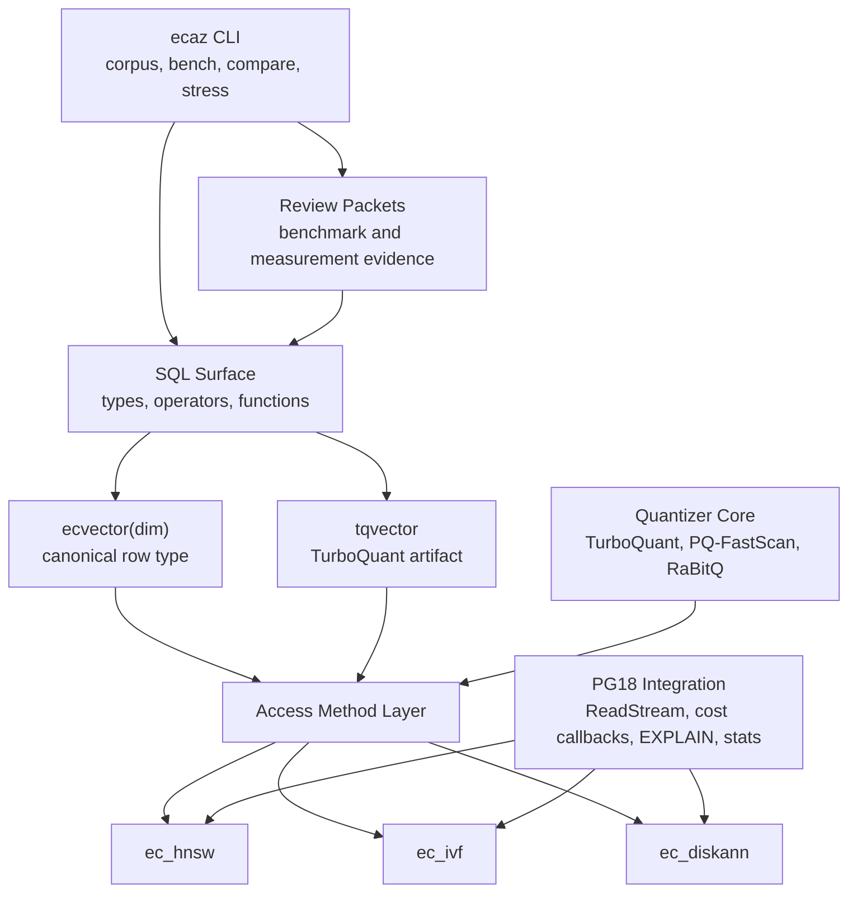

# Master Requirements Specification
## Ecaz - PostgreSQL Extension for Compressed Vector Search

## 1. Purpose

Ecaz is a PostgreSQL extension, written in Rust with pgrx, that provides native vector storage, compressed vector artifacts, and multiple ANN index access methods inside PostgreSQL.

This specification is the top-level requirements artifact for the current main-branch implementation. It defines the product surface, scope boundaries, requirement structure, verification policy, and known deferrals for:

- `ecvector(dim)`, the canonical exact/raw row type
- `tqvector`, the explicit TurboQuant artifact/debugging type
- `ec_hnsw`, the default general-purpose graph access method
- `ec_ivf`, the optional IVF posting-list access method
- `ec_diskann`, the optional DiskANN/Vamana-style graph access method
- `ecaz`, the operator CLI for corpus, benchmark, comparison, stress, quantizer, and local development workflows
- Shared quantizer, scoring, planner, observability, WAL, and benchmark evidence requirements

## 2. Scope

### 2.1 In Scope

This specification governs:

- PostgreSQL extension lifecycle: `CREATE EXTENSION ecaz`, upgrade packaging, and drop behavior
- SQL bootstrap for types, operators, functions, casts, access methods, and operator classes
- `ecvector(dim)` text I/O, binary I/O, typmod validation, casts, and exact/raw row storage
- `tqvector` TurboQuant artifact encoding, text I/O, binary I/O, and debug/operator surfaces
- TurboQuant-family quantization: SRHT rotation, Lloyd-Max MSE quantization, QJL residual correction, deterministic seeding, and prepared-query scoring
- Shared quantizer profiles used by index access methods: TurboQuant, PQ-FastScan, and RaBitQ where enabled by each AM
- HNSW build, scan, insert, vacuum, page layout, reloptions, GUCs, planner costing, PG18 ReadStream, EXPLAIN, stats, and parallel build behavior
- IVF centroid training, posting-list persistence, scan/rerank behavior, insert/vacuum/admin snapshots, reloptions, GUCs, planner costing, and measurement evidence
- DiskANN/Vamana build, persisted graph format, binary sidecar prefilter, grouped-PQ traversal fallback, heap rerank, insert/vacuum repair, unit-normalized v0 contract, reloptions, GUCs, planner costing, and measurement evidence
- WAL safety for index mutations and crash-safe page writes
- The `ecaz` operator CLI command tree, access-method profiles, benchmark/comparison/stress workflows, and review-packet logging behavior
- Benchmark methodology and review-packet artifact provenance for any performance or recall claim

### 2.2 Out of Scope

This specification does not govern:

- The TurboQuant, HNSW, IVF, DiskANN, PQ-FastScan, or RaBitQ research papers themselves
- Application schema design above the extension boundary
- Query routing, cross-agent fan-out, and shard selection
- Product benchmark claims not backed by dedicated controlled hardware
- GPU/offline build trainers, OPQ/AQ/LSQ successors, SPANN, and parallel index scan unless reactivated by a later accepted ADR
- Cosine and L2 operator families in the current v0 inner-product surface

## 3. Current Product Surface

### 3.1 SQL Types

| Type | Role | Status |
| --- | --- | --- |
| `ecvector(dim)` | Canonical exact/raw row type for normal user tables | Implemented |
| `ecvector` | Typmod-less exact/raw row type for flexible internal/test surfaces | Implemented |
| `tqvector` | TurboQuant-family persisted artifact and debugging type | Implemented, non-canonical for new applications |

`encode_to_ecvector(real[], bits, seed)` is the canonical ingest helper. Current main accepts only the canonical quantizer defaults `(4, 42)` and stores raw fp32 payloads as `ecvector`; other bit/seed pairs are rejected.

`encode_to_tqvector(real[], bits, seed)` remains available for explicit TurboQuant artifact generation.

### 3.2 SQL Operators and Access Methods

| Access Method | Opclasses | Primary Role | Status |
| --- | --- | --- | --- |
| `ec_hnsw` | `ecvector_ip_ops`, `tqvector_ip_ops` | Default general-purpose ANN graph index | Implemented |
| `ec_ivf` | `ecvector_ip_ops`, `tqvector_ip_ops` | Optional posting-list index for IVF tradeoff measurement | Implemented local v1 |
| `ec_diskann` | `ecvector_diskann_ip_ops`, `tqvector_diskann_ip_ops` | Optional Vamana/DiskANN-style graph index | Implemented local v1 |

All current index families expose inner-product ordering through `<#>` as negative inner product so `ORDER BY embedding <#> query ASC LIMIT k` returns highest-similarity rows first.

### 3.3 Access Method Positioning

`ec_hnsw` remains the default user-facing AM. It has the broadest operational coverage and supports multiple storage formats behind a stable SQL surface.

`ec_ivf` is an opt-in AM for posting-list experiments, high-ingest tradeoffs, and quantizer/storage comparisons. Local Task 28 evidence is landed; product claims require controlled hardware.

`ec_diskann` is an opt-in AM for Vamana/DiskANN research and disk-resident graph comparisons. Local Task 29 evidence is landed; the v0 distance wrapper requires finite unit-normalized source vectors.

## 4. Architecture



### 4.1 Module Structure

The implementation follows the multi-AM module layout established by ADR-041:

```
src/
├── lib.rs
├── am/
│   ├── common/
│   ├── ec_hnsw/
│   ├── ec_ivf/
│   └── ec_diskann/
├── quant/
├── storage/
├── pg18_pgstat_shim.rs
└── standalone_pg_backend_stubs.rs
```

Shared behavior belongs under `am/common`, `quant`, or `storage`. AM-specific page formats, scan state, insert/vacuum logic, and diagnostics remain under the owning AM.

## 5. Data Model

### 5.1 `ecvector`

`ecvector(dim)` stores exact fp32 vectors and enforces dimensionality through PostgreSQL typmod when typmod is present. It is the canonical heap-column type for user tables and the default source for HNSW, IVF, and DiskANN index builds and rerank.

The typmod-less `ecvector` form is supported for flexible internal surfaces; index metadata then owns dimension consistency for indexed relations.

### 5.2 `tqvector`

`tqvector` stores the TurboQuant artifact:

```
Offset  Size    Field
0       2       dim
2       1       bits
3       8       seed
11      4       gamma
15      var     code bytes: mse_packed || qjl_packed
```

At 1536 dimensions and 4-bit encoding, the artifact is 783 bytes total: 11-byte prefix plus a 772-byte quantized payload.

### 5.3 Index Storage

Each AM owns its persisted index format:

- `ec_hnsw`: layered HNSW element/neighbor tuples, optional binary sidecars, optional rerank payloads, and storage-format-specific tuple variants
- `ec_ivf`: metadata, centroid directory, posting-list pages, optional PQ/RaBitQ payloads, slack pages, and admin/drift snapshots
- `ec_diskann`: Vamana nodes, medoid metadata, grouped-PQ codebook chain, binary sidecars, duplicate overflow chains, and vacuum repair metadata

Cross-AM page-layout reuse is allowed only through shared helpers with explicit format adapters.

## 6. PG Version and Operational Surface

PostgreSQL 18 is the primary target. PG18-specific features are gated with `#[cfg(feature = "pg18")]` and include:

- ReadStream-backed scan/vacuum paths where implemented
- `amgettreeheight`, `amtranslatestrategy`, and `amtranslatecmptype`
- `amconsistentordering`
- custom `EXPLAIN (ecaz)` option and per-node scan counters
- custom statistics registration when loaded through `shared_preload_libraries`
- module identity/version reporting

PostgreSQL 17 remains a compatibility fallback without the PG18-only callback and diagnostics surface.

## 7. Benchmark and Evidence Policy

Measurement claims SHALL distinguish:

- local development evidence
- review-packet evidence with packet-local raw artifacts
- product benchmark claims on dedicated controlled hardware

Local landed evidence currently includes:

- HNSW DBpedia recall baseline
- IVF Task 28 local v1 results at 10K, 25K, 100K, and directional 990K
- DiskANN Task 29 local readiness results against pgvectorscale and HNSW references

The supported operator surface for repeatable corpus setup, benchmarking, comparison, diagnostics, stress harnesses, and packet-local logs is `ecaz` from `crates/ecaz-cli`.

Product benchmark claims require controlled cache state, hardware, storage, PostgreSQL settings, command provenance, and packet-local raw logs.

## 8. Requirement Architecture

```
spec/
├── spec.md
├── stakeholder/
├── usecase/
├── functional/
├── non-functional/
├── adr/
├── tests.md
└── assets/
```

Requirement identifiers are immutable once assigned:

| Artifact | Format |
| --- | --- |
| Stakeholder requirement | `StR-XXX` |
| User story | `US-XXX` |
| Functional requirement | `FR-XXX` |
| Non-functional requirement | `NFR-XXX` |
| Acceptance criterion | `{PARENT}-AC-N` |
| Test case | `TC-XXX` |

## 9. Lifecycle Status

Requirement and ADR statuses use:

- `DRAFT`: under active definition
- `APPROVED`: accepted requirement, not necessarily implemented
- `IMPLEMENTED`: implemented on main
- `VERIFIED`: implemented and covered by durable test or measurement evidence
- `SHELVED`: deliberately inactive until a future decision reopens it
- `DEPRECATED`: retained for history but no longer part of the current product surface
- `SUPERSEDED`: replaced by a newer artifact

## 10. Known Deferrals

- Parallel index scan is shelved indefinitely; it is not the current scaling frontier.
- HNSW insert-throughput decontention remains future work.
- Larger HNSW parallel build and product benchmark runs are deferred to AWS/RDS-class hardware.
- IVF and DiskANN local evidence is landed, but larger product claims require controlled benchmark hardware.
- GPU/offline build trainers, OPQ/AQ/LSQ successors, SPANN, and additional distance metrics remain outside the current implemented surface.

## 11. References

- README: `README.md`
- Usage docs: `docs/usage.md`
- Benchmarks: `docs/benchmarks.md`
- Operator CLI: `crates/ecaz-cli/README.md`
- Architecture docs: `docs/architecture.md`
- ADR index: `spec/adr/index.md`
- TurboQuant paper: <https://arxiv.org/abs/2504.19874>
- DiskANN paper: <https://suhasjs.github.io/files/diskann_neurips19.pdf>
- pgvector source: <https://github.com/pgvector/pgvector>
